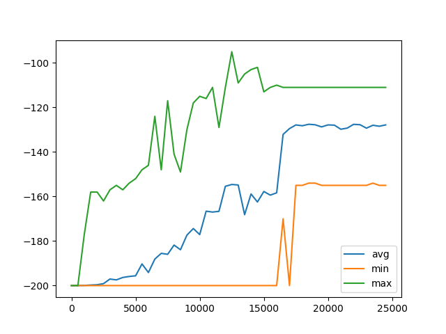

# DQN and Q-Learning
This repo contains implementations of Q-Learning and and will soon contain implementations of its predecessor as well: DQN, the original deep reinforcement learning algorithm. These implementations were built solely for learning purposes by following Sentdex's [reinforcement learning tutorial series](https://www.youtube.com/playlist?list=PLQVvvaa0QuDezJFIOU5wDdfy4e9vdnx-7). 

DQN is a variant of Q-Learning which uses deep neural networks. Q-Learning refers to algorithms which learn an action-value function `Q(s, a)` which attempts to predict the Q or *quality* of a given state `s` which we will receive given that we take a certain action `a`. These state-action combinations are looked up from a table of Q-values--in other words, the agent slowly memorizes the optimal actions for each state. Deep Q-Learning improves upon this by using a deep neural network to learn a function which maps the patterns within the table, meaning that old experiences can be extrapolated to new ones. Thus we go from memorization to intelligence.

DQN is an especially noteworthy algorithm as it was the first deep reinforcement learning algorithm ever created. It was introduced by DeepMind in their [2013 paper](https://deepmind.com/research/publications/playing-atari-deep-reinforcement-learning) in which this single algorithm was demonstrated to achieve superhuman performance on a large number of Atari games. Today it has been superseded by a variety of other deep reinforcement learning algorithms such as PPO and A3C, but DQN is still the subject of active academic interest as evidenced by emerging variants such as Double DQN and Rainbow. 

From a learning perspective, DQN is especially interesting because for all its effectiveness and complexity, it's still one of the simplest deep reinforcement learning algorithms. It has been aptly called the "Hello World" of deep reinforcement learning. 

# Q-Learning

This repo contains implementations of the vanilla Q-Learning algorithm in both the MountainCar-V0 environment from OpenAI's Gym as well as a custom "blob world" environment. The implementations provided by Sentdex's tutorials are not fully dynamic such that the same agent could be reused for different environments, and in fact many of the hyperparameters used are hardcoded to be completely static. Some next steps to improve this project would be to fix both of those errors by making the implementations more DRY and modular.

Below you can see a graph of the training performance of the vanilla Q-Learning agent on MountainCar-V0. Within the relevant folder you can also find a video of how its Q-tables are updated as it trains, entitled `qlearning.avi`.

# DQN

This repo does not yet contain implementations of DQN. 
